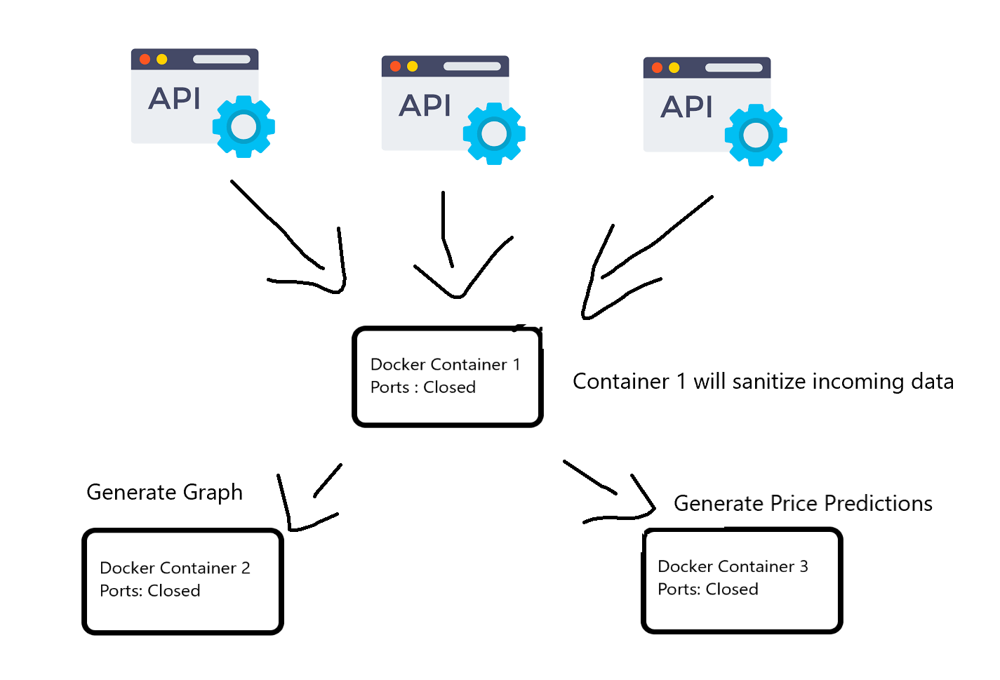

# CryptoSignal

## Description
A Python Application based on a Microservice architecture. Uses Docker, MYSQL and has been tested with Kubernetes. Application produces Signals which analyse positive and negative movements in Market Prices. The Markets allow the use of their API's for ingesting and analysing market data, the Application will also web scrape to gather information from markets without API's.

{:height="36px" width="36px"}

## Objectives

- Create Python Algorithm to analyse Crypto Market real-time
- The application will generate graphs to show market price trends - fluctuations - predictions using different colour markers
- Store data securely
- Use Docker-Compose to run multiple containers.
- Use 3 Datasources initially
- Output Predicted daily end price

Graphs generated can be :
- Emailed
- Stored in a secure azure storage container.
